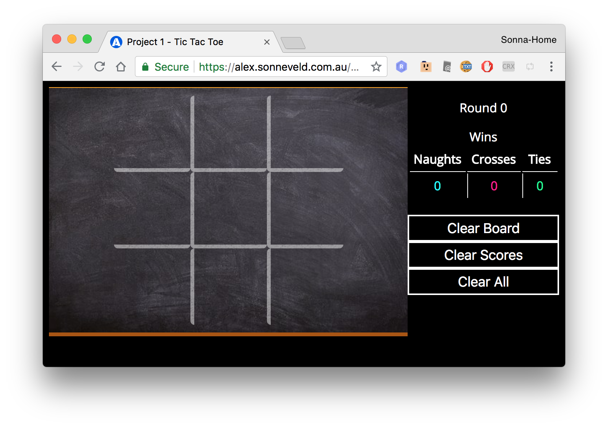

# WDI Project 1 - Tic Tac Toe

To enjoy the game of Tic Tac Toe feature within this project repository, please
use the following link:

[https://alex.sonneveld.com.au/wdi-project1/](https://alex.sonneveld.com.au/wdi-project1/)

_To see more involved thought and development process see the
[steps undertaken document](steps_undertaken.md) for more details._



## Overview

> Tic-tac-toe (also known as noughts and crosses or Xs and Os) is a
> paper-and-pencil game for two players, X and O, who take turns marking the
> spaces in a 3×3 grid. The player who succeeds in placing three of their marks
> in a horizontal, vertical, or diagonal row wins the game.
>
> -- [Wikipedia](https://en.wikipedia.org/wiki/Tic-tac-toe)

## Objective

Build the Tic Tac Toe game as web application for two players

## Technologies Used

- HTML5
- CSS3
- JavaScript
- SVG
- Local Storage
- Git
- GitHub.com & GitHub Pages

## Features

- Scoreboard
- Clear Board Button
- Reset Score Button
- Drawing animations
- Sound effects

## General Approach

 1. Build the board
 2. Build the player pieces
 3. Add functionality to add pieces to the board
 4. Check if the board has a winner
    a) Check rows
    b) Check columns
    c) Check diagonals
 5. Declare the winner
 6. Extend the application from
 7. ... ?
 8. Profit!

There was not much planning outside of the code, since it was a well known game
/ problem, and most planning was done through the code in terms of layout,
presentation and then functionality.

## Things learned

- Using LocalStorage directly, rather than indirectly as in previous projects
- Including `svg` as assets from external files, rather than inlined
- Web Audio objects
- Refresher of the JavaScript basics

## Unsolved/Unresolved Problems

- The use of `svg` was neat for creating self-contained animations, but required
  `iframe` element for the animation to be replayed for each new instance. This
  could be resolve by building the `svg` element each time, but loses the
  advantage of being asset. Maybe using `canvas` and elements could resolve this
  issue, but would still push animations into the JavaScript, which I was trying
  to avoid.

- Scaling `iframe` within the board is not possible, if they were images or
  inlined `svg` they could better scale within the page. If they using an `img`
  tag then the following rules could be applied to easily scale the board

  ```css
    /* style.css */
    @media (min-width: 600px) {
      iframe.cross,
      iframe.naught,
      img.cross,
      img.naught {
        left: 20%;
        top: 20%;
        height: 15vw;
        width: 15vw;
      }
    }

    @media (min-width: 600px) {
      .cell {
        height: 25vw;
        width: 25vw;
      }
    }
  ```

## Future design plans

If I were to continue developing this further, besides resolving the unresolved
issues, I would look at refactoring and separating code dealing with building vs
updating state of the board into separate scripts. If the `Board` became object
have better handling of its state, deactivating or reactivating functions
between states, and animations or loading in process.

However, any more updates tend to drift further and further away from the
original problem and where it is now should be just fine.

## Acknowledgements

Thanks to [DT](https://github.com/epoch) and
[Kasun](https://github.com/kasun-maldeni) the WDI6 class for your tutorage!

This project was undertaken as part of the General Assembly WDI course 2018.
